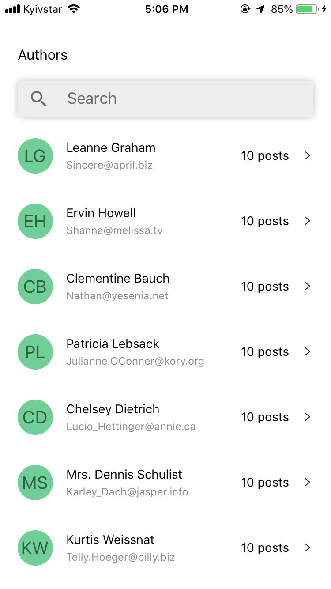

# test-task-react-native

# iOS

​
​
​

# Android

​
​

Task:
Please create a mobile app using React Native, publish your code in your GitHub account, add screenshots of your app to the readme file. 

The application contains 2 screens:
Authors screen. It shows a list of authors. User can search by name and email 
Posts screen. It  Shows posts by selected Author.  User can search by title and post content 

The screens you can find in Figma

https://www.figma.com/file/dO5c5E0uC3K56OKDnTMXdc/Test-App?node-id=0%3A1

Use these API endpoints to get the required data.

https://jsonplaceholder.typicode.com/users
https://jsonplaceholder.typicode.com/posts
